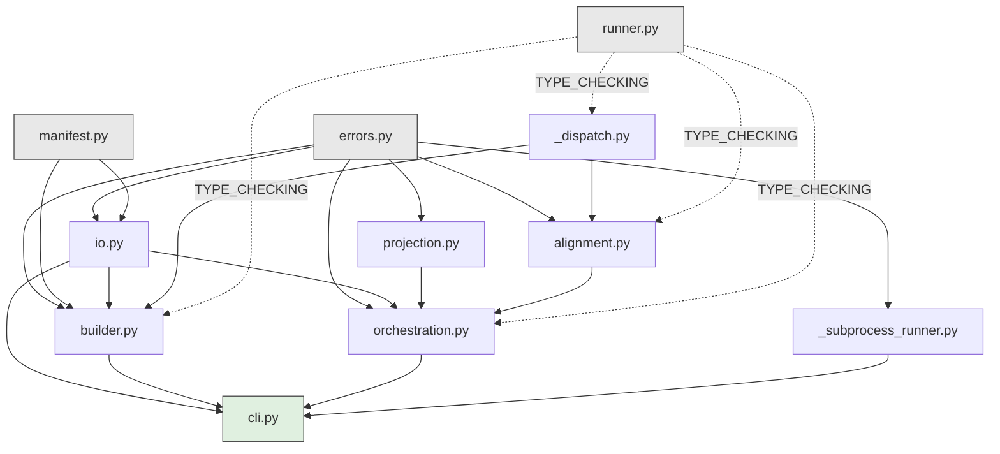
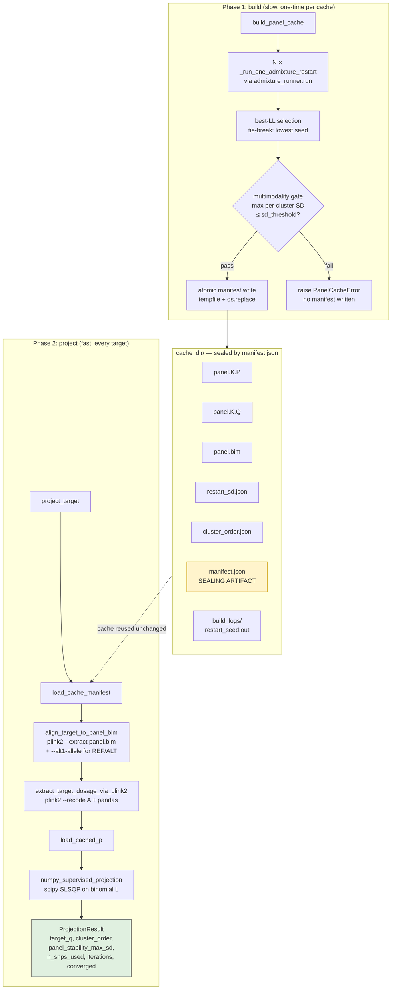
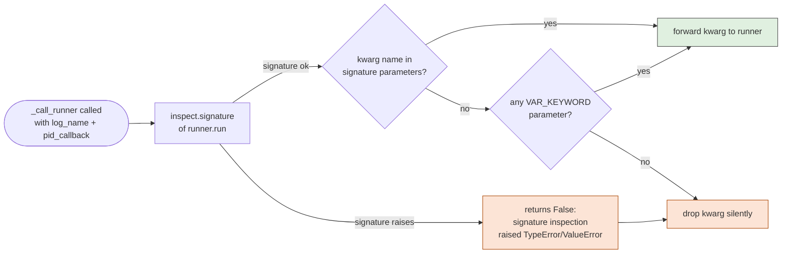
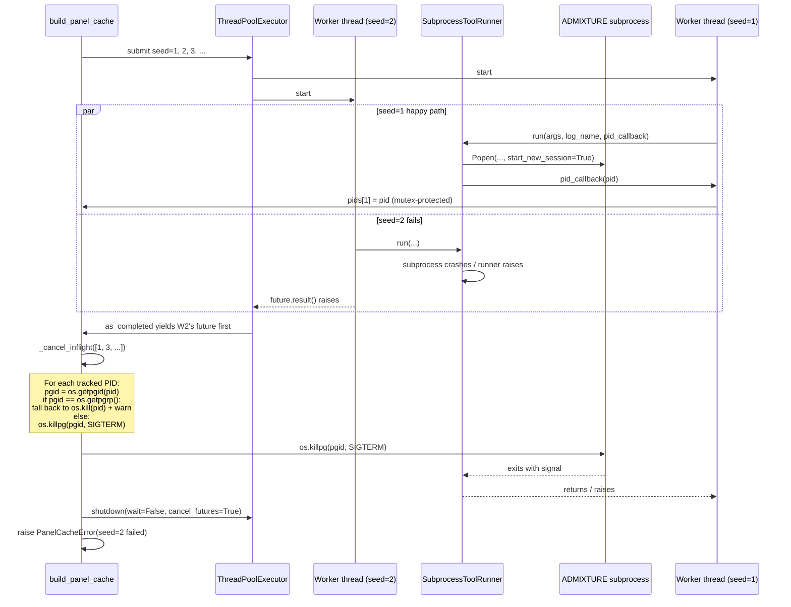

# Development guide

The "why" behind the code. For setup, validation gates, and PR conventions, see [`CONTRIBUTING.md`](CONTRIBUTING.md). For the release runbook, see [`docs/RELEASE.md`](docs/RELEASE.md). For user-facing usage, see [`README.md`](README.md). For release history, see [`CHANGELOG.md`](CHANGELOG.md).

## Architectural shape in one paragraph

`admixture-cache` splits the supervised-ADMIXTURE workflow into two phases so the per-target hot path doesn't pay the panel-training cost. **Phase 1 — `build_panel_cache`** runs stock ADMIXTURE × N restarts via an injected `ToolRunner`, validates that the per-cluster restart standard deviation stays under a threshold (multimodality check), picks the best-LL P matrix, and writes a sealed cache directory whose `manifest.json` SHA-pins every input. **Phase 2 — `project_target`** loads the cached P, aligns target.bed to the cached panel.bim (variant set + REF/ALT axes via plink2), reads the target as a dosage vector, and solves for Q via `scipy.optimize.minimize(method="SLSQP")` against the binomial admixture likelihood `L(q) = ∏_s Binomial(g_s; 2, q^T P_s)` subject to the simplex constraint (`sum(q)=1, q≥0`). The math matches stock `admixture --supervised` Q to ~1e-5 absolute on AADR v66 HO (15K samples × 850K SNPs at K=4); phase 1 takes ~hours-per-restart, phase 2 takes ~30 seconds end-to-end on the same panel — of which ~28 s is the pandas `--recode A` parse, ~0.02 s is the actual SLSQP solve, and the remainder is plink2-based variant intersection + axis alignment. (The "~2 seconds" figure scattered through the README and `orchestration.py` docstring refers to a smaller, LD-pruned panel; the dominant cost is the dosage-load step and replacing it with a binary BED reader is a v1.x stretch goal.)

## Module map

```
src/admixture_cache/
├── __init__.py        # public API re-exports
├── projection.py      # numpy_supervised_projection + ProjectionResult
├── builder.py             # build_panel_cache, _run_one_admixture_restart, ld_prune_panel
├── manifest.py            # PanelCacheManifest pydantic model + track/continent validator
├── alignment.py           # align_target_to_panel_bim, extract_target_dosage_via_plink2
├── io.py                  # load_cached_p, load_cache_manifest, verify_..., sha256_file
├── orchestration.py       # project_target end-to-end wrapper
├── _dispatch.py           # _call_runner + _runner_supports (Protocol extension forwarder)
├── _paths.py              # append_suffix (avoids Path.with_suffix dotted-stem bug)
├── _subprocess_runner.py  # reference SubprocessToolRunner implementation
├── cli.py                 # admixture-cache console script
├── runner.py              # ToolRunner Protocol
├── errors.py              # PanelCacheError + PopAutomationConfigError alias
└── py.typed               # PEP 561 marker (consumers get our type info)
```

### Dependency convention (enforced by import-linter)

| Module | Imports from |
|---|---|
| `errors.py` | stdlib only |
| `runner.py` | stdlib only (`Protocol`, `Path`) |
| `manifest.py` | stdlib + pydantic |
| `_dispatch.py` | stdlib + `runner` (TYPE_CHECKING) |
| `_paths.py` | stdlib only |
| `projection.py` | stdlib + numpy + scipy + `errors` |
| `io.py` | stdlib + numpy + `errors` + `manifest` |
| `alignment.py` | stdlib + numpy + pandas (inline) + `errors` + `_dispatch` + `runner` (TYPE_CHECKING) |
| `_subprocess_runner.py` | stdlib + `errors` |
| `builder.py` | stdlib + numpy + `errors` + `manifest` + `io` + `_dispatch` + `runner` (TYPE_CHECKING) |
| `orchestration.py` | stdlib + numpy + `errors` + `alignment` + `io` + `projection` + `runner` (TYPE_CHECKING) |
| `cli.py` | everything (it's the integration point) |

The dependency graph is acyclic:



Key observations:

- **Roots** (`errors`, `runner`, `manifest`) — no internal dependencies.
- `builder` and `orchestration` are siblings — neither imports the other. Phase 1 (build) and phase 2 (project) only share the `io` / `manifest` modules below them.
- `alignment` and `projection` don't import each other; `orchestration` is the first place they meet.
- `runner` is imported only under `TYPE_CHECKING` in the implementation modules (dotted edges above). The injected runner objects are used structurally at runtime without needing the Protocol class itself.
- Layering is enforced by **import-linter** (config in `pyproject.toml` under `[tool.importlinter]`); CI runs `lint-imports` as a fourth gate alongside pytest/ruff/mypy. The contract type is `layers`: each declared layer can only import from layers *above* it (lower index). Adding a new module means adding it to the right layer; if the import-linter check fails, that's the signal.

## Two-phase data flow



Both phases are reachable two ways: directly from Python (`from admixture_cache import build_panel_cache`) or via the CLI (`admixture-cache build` / `admixture-cache project`). The CLI is the integration point — it instantiates a default `SubprocessToolRunner` and forwards argparse-validated kwargs to the library functions.

## Input file formats

The library doesn't define new file formats — it composes PLINK conventions + a tiny YAML signal.

- **`panel.bed/.bim/.fam`** — standard PLINK binary BED triplet (used as ADMIXTURE input and the alignment reference).
- **`panel.pop`** — ADMIXTURE supervised mode's per-row label file. One line per sample (same order as the `.fam`), values are either a cluster name or `-` (meaning "unlabeled, project onto the clusters"). E.g.:
  ```
  Yoruba
  Han
  -
  Yoruba
  -
  ```
  ADMIXTURE supervised mode determines the K columns of the output `.Q` by the FIRST-APPEARANCE order of non-`-` labels in this file. `_derive_cluster_order_from_pop_file` in `builder.py` recovers that mapping; if you change ADMIXTURE's convention you need to update this function.
- **`clusters.yaml`** — opaque to admixture-cache (we only SHA-hash it). Convention: it's the operator's source-of-truth for which sample IDs map to which cluster name. Different orchestrators format it differently; the library only cares that the SHA changes when curation changes.
- **`geo_filter_yamls`** — optional. A dict-of-name-to-path indicating per-category filter YAMLs (e.g. `{"ancestry": "anc_filter.yaml", "continent": "cont_filter.yaml"}`). admixture-cache SHA-hashes each and stores them in `manifest.geo_filter_yaml_shas` so future cache verifies can detect curation changes.
- **plink2 `--alt1-allele` magic columns** — in `alignment.py`, the call `--alt1-allele panel.bim 5 2` passes (file, alt_col=5, id_col=2) where the indices are 1-based into the BIM file's tab-separated fields. BIM column 2 is the variant ID (rsID or chr:pos:ref:alt), column 5 is the ALT allele. We force the target's ALT axis to match the panel's at every overlapping variant — flipping dosages where needed.

## The cache contract (sealed by `manifest.json`)

`manifest.json` is the single source of truth for "is this cache valid?". The write is **atomic** (`tempfile + os.fsync + os.replace`) so a SIGKILL / power-loss / OS crash mid-write leaves either the prior complete manifest or no manifest at all — never a half-written JSON. The presence of `manifest.json` is the cache-valid signal; all other artifacts (`panel.K.P`, `panel.K.Q`, `panel.bim`, `restart_sd.json`, `cluster_order.json`, `build_logs/`) are written BEFORE the manifest, so a manifest implies the rest are present.

### Which manifest fields gate cache validity

`io.verify_cache_matches_current_config` compares:

- `panel_bim_sha256` ↔ caller's current panel.bim SHA
- `clusters_yaml_sha256` ↔ caller's current clusters.yaml SHA
- `k` ↔ caller's current K
- `geo_filter_yaml_shas` ↔ caller's current dict (symmetric: a cache with pins reports mismatch against a caller who omits them, AND vice versa)

Other manifest fields are observability or provenance, not gating: `cluster_order`, `seeds_used`, `best_seed`, `best_loglikelihood`, `restart_sd_max`, `admixture_version`, `pgen_samplebind_version`, `build_wallclock_seconds`, `build_timestamp`. Changing these doesn't invalidate the cache.

### `build_logs/` layout

One file per restart, named `restart_<seed>.out`, containing the ADMIXTURE process's combined stdout + stderr (the `SubprocessToolRunner` redirects stderr to stdout). If a rerun rotates a prior log, the previous attempt's content lives at `restart_<seed>.out.prev` (only the most recent prior attempt is preserved — successive reruns overwrite the `.prev`). The library never deletes log files; clean-up is the operator's responsibility.

### Best-LL tie-break determinism

`best = max(with_ll, key=lambda r: r["ll"])` picks the highest LL. Ties go to Python's `max` first-in-iteration-order tiebreak; since `per_restart_results` is sorted by seed before the LL filter, ties resolve to the LOWEST-seed restart. This means re-runs of the same build with the same seeds produce byte-identical caches even when multiple restarts hit the same LL (rare but possible at K≥21 on heavily-pruned panels).

### Where pydantic validation actually fires

The track/continent consistency validator (`manifest._validate_track_continent_consistency`) runs at `PanelCacheManifest(...)` construction, which happens at the END of `build_panel_cache` — after all N ADMIXTURE restarts have completed (hours of work). A build called with `track="ancestral_cluster"` but `continent=None` runs to completion, then raises `ValidationError` at manifest write. The CLI catches this in `_cmd_build` by checking the argparse-validated namespace BEFORE invoking the library, so `admixture-cache build` fails fast. **Library-level callers don't get this short-circuit** — if you're building a higher-level wrapper, mirror the early check.

## Schema evolution

`PanelCacheManifest` uses `model_config = ConfigDict(extra="forbid")`, which makes forward-compat asymmetric. Rules for adding or modifying fields:

| Change | Backward-compat (old caches load on new code)? | Forward-compat (new caches load on old code)? |
|---|---|---|
| Add field with default (e.g. `new_field: str = "default"` or `new_field: int \| None = None`) | ✓ yes — Pydantic substitutes the default | ✗ no — `extra="forbid"` rejects the unknown field |
| Add required field (no default) | ✗ no — old caches missing it raise ValidationError | ✗ no — same forward-compat issue |
| Remove a field | ✗ no — old caches still have the field, and `extra="forbid"` rejects it as unknown on the new schema | n/a |
| Rename a field | breaking either way — model both as add + remove | breaking either way |
| Add a new track/continent enum value | ✓ yes — old caches don't have it | ✓ yes if the validator accepts it without other code paths needing updates |

**Bump `schema_version`** when any change is breaking. Currently `schema_version: int = 1`. A future v2 manifest would need a load-time dispatcher (read the version field first, then branch on schema-specific parsers). Not implemented yet — when the first breaking change lands, design that path.

**`extra="forbid"` is load-bearing**: a `v1` consumer reading a hypothetical `v2` cache that added a required `phasing_version` field would silently ignore it without the strict mode. The cache might be subtly wrong (e.g. computed on phased data, but the consumer treats it as unphased) and there's no way to surface the mismatch. Don't relax it.

## Key data structures

### `PanelCacheManifest` (`manifest.py`)

Pydantic model. Fields fall into three buckets:

| Bucket | Fields | Purpose |
|---|---|---|
| **Gating** (cache-validity SHAs) | `panel_bim_sha256`, `clusters_yaml_sha256`, `k`, `geo_filter_yaml_shas` | mismatch ⇒ cache invalid, rebuild |
| **Provenance** (version pins, no enforcement) | `panel_id`, `panel_version`, `admixture_version`, `pgen_samplebind_version` | record what produced this cache; manual cross-check only |
| **Observability** (operator diagnostics) | `seeds_used`, `best_seed`, `best_loglikelihood`, `restart_sd_max`, `cluster_order`, `build_wallclock_seconds`, `build_timestamp` | useful for debugging but not cache-gating |

`build_timestamp` is a `datetime` (since v1.0.0; was `str` in v0.x — pydantic re-parses old ISO-8601 strings transparently). `geo_filter_yaml_shas` is a `dict[str, str]` where keys are caller-chosen category names (e.g. `"ancestry"`, `"continent"`, `"region"`) and values are hex SHA-256 digests. `pgen_samplebind_version` is an optional version pin for callers that pre-process their panel via [pgen-samplebind](https://github.com/carstenerickson/pgen-samplebind); it's recorded so a cache built against pgen-samplebind v1.2 can be distinguished from one built against v1.3 even when the panel.bim SHAs happen to match.

### `ProjectionResult` (`projection.py`)

`@dataclass(frozen=True)`. Return type of `project_target` and `numpy_supervised_projection` (indirectly). The Q vector lives alongside its provenance: cluster names, the panel's restart-SD bound (so consumers can decide whether the build was tight enough for their use case), non-missing SNP count, SLSQP iteration count, and a `converged` boolean. Immutable so it's safe to pass across function boundaries without defensive copies.

### `ToolRunner` Protocol (`runner.py`)

Structural interface for the subprocess plumbing. The library doesn't ship a fixed runner — callers pass any object satisfying the Protocol. Why a Protocol over a fixed class:

- Most consumers already have their own subprocess wrapper (with timeout / logging / retry / metrics conventions). Forcing them to use ours would be a worse fit than letting them adapt theirs.
- A Protocol gives static type-checking ("does this object satisfy `ToolRunner`?") without forcing inheritance.
- Adding new optional Protocol parameters (`log_name`, `pid_callback`) is API-additive — runners that predate the extension still satisfy the Protocol, and the library detects support via `inspect.signature` at call time.

The reference implementation `SubprocessToolRunner` lives in `_subprocess_runner.py` (a private module to keep `runner.py` stdlib-only — see Dependency convention table above — while still letting the package re-export `SubprocessToolRunner` top-down from `__init__.py`). Library users import it as `from admixture_cache import SubprocessToolRunner` (or, equivalently, `from admixture_cache._subprocess_runner import SubprocessToolRunner`). The CLI re-uses the same class for its console-script default. v1.0–v1.1.0 housed it in `cli.py`, which created a circular `__init__ → cli → __init__` import that worked but was order-sensitive; v1.1.1 moved it out to break that cycle.

## The runner-extension dispatch story

The library has extended the `ToolRunner` Protocol over two minor releases: v1.0.0 added `log_name` + `pid_callback`; v1.1.0 added `argv_prefix`. Each kwarg is detected at call time via `inspect.signature` (`_dispatch._runner_supports`):



The check runs ONCE per `_call_runner` invocation, separately for each optional kwarg. If the runner's `run` method accepts the kwarg directly OR has a `VAR_KEYWORD` (`**kwargs`) parameter, the dispatcher forwards it; otherwise it's silently dropped.

The dispatcher is `_dispatch._call_runner`. It's called from:

- `builder._run_one_admixture_restart` (passes `log_name`, `pid_callback`, AND `argv_prefix` when NUMA pinning is active) — the parallel-restart hot path where all three extensions matter.
- `builder.ld_prune_panel` (passes `log_name` — the two plink2 calls each get a distinct log).
- `alignment.align_target_to_panel_bim` and `alignment.extract_target_dosage_via_plink2` (pass `log_name` so per-call logs stay collision-free when a caller batches multiple projections through a shared `work_dir`).

For NEW call sites, always route through `_call_runner` so the kwargs get introspection-based degradation for free. Direct `runner.run(...)` calls bypass that and silently lose Protocol extensions on older runners.

### Two gotchas

1. **`**kwargs` forwarders are recognized as supporting any kwarg** — but the library only inspects the SIGNATURE, not the runner's BODY. An adapter that explicitly enumerates downstream args (e.g., `def run(self, **kwargs): return self._inner.run(args=kwargs["args"], cwd=kwargs["cwd"], ...)` — silently dropping `log_name`/`pid_callback`) will pass the introspection check but break the dispatch contract. Concrete failure modes:
    - Logs from concurrent restarts overwrite each other ⇒ multimodality validation runs against the wrong Q matrix ⇒ incoherent best-LL selection.
    - No PID is registered with the cancellation tracker ⇒ on first-failure, `_cancel_inflight` is a no-op ⇒ peer restarts run to natural completion (up to `per_restart_timeout_seconds` ≈ 24 h each).

    README documents this contract loudly. A `**kwargs` runner that doesn't forward what it receives is a contract violation, not a library bug — but the library can't detect it.

2. **Parallel mode requires BOTH `log_name` AND `pid_callback`.** The guard fires in `build_panel_cache` near the top of the parallel branch (search for `missing = [param for param in ("log_name", "pid_callback")`). Without `log_name`, concurrent restarts can't disambiguate their log files. Without `pid_callback`, cancellation is a no-op as above. Either alone is insufficient; the guard surfaces missing support at build start instead of via a multi-hour hang.

For runners that lack both kwargs, sequential mode (`max_parallel_restarts=1`) still works. `_run_one_admixture_restart` has a sequential-only log-discovery fallback (gated by `allow_log_scan_fallback`) that snapshots `log_dir` before each call and identifies the new/modified-during-call file (mtime-aware, excludes `.prev` rotation artifacts).

## The memory-bandwidth heuristic

The canonical explanation lives in `build_panel_cache`'s docstring + `_auto_max_parallel_restarts`'s docstring. Summary: `max_parallel_restarts=None` (default) triggers `cores // max(threads * 2, 1)`, capped at `len(seeds)`, floor 1. The `(threads * 2)` denominator (vs. naive `cores // threads`) accounts for ADMIXTURE being memory-bandwidth-bound at typical panel sizes (≥10K samples × ≥500K SNPs at K≥4); beyond ~2-3 parallel restarts on a single-socket machine, additional parallelism mostly burns DRAM bandwidth without reducing wallclock. Empirical numbers in the docstring. Tested across the parametric matrix in `tests/unit/test_builder.py::TestAutoMaxParallelRestarts`.

## Cancellation contract

When one restart in a parallel build fails, the other in-flight subprocesses must be terminated promptly — otherwise the build hangs for `per_restart_timeout_seconds` (default 86400 = 24 h) waiting for them to finish naturally.



### The pgid safety check

After computing `pgid = os.getpgid(pid)`, the code checks `if pgid == os.getpgrp()`. `os.getpgrp()` is OUR (the parent's) pgid. If they're equal, the runner didn't use `start_new_session` — the child inherited our process group — and `os.killpg(pgid, SIGTERM)` would signal US too. In that case the code falls back to bare `os.kill(pid, SIGTERM)` with a warning log.

### Why pgid signaling, not bare PID

- **PID-recycle safety**: between a subprocess exiting and `_cancel_inflight` reading the registered PID, the kernel might recycle the PID to an unrelated process. Bare `os.kill(old_pid)` would then signal the wrong process. Process group IDs recycle much more slowly.
- **Grandchild cleanup**: if the spawned subprocess itself spawns children, `killpg` reaches the whole tree.

### What happens on SIGKILL to the orchestrator

Python's interpreter teardown can't reap subprocesses on SIGKILL (the signal doesn't run cleanup handlers). Children spawned with `start_new_session=True` keep running until they finish naturally. This is the same hazard as any subprocess library; the documented mitigation is "spawn under a process supervisor (systemd-run, tini) that handles your group's cleanup."

## Validation gates

Three local gates, each gating each commit:

1. **`pytest`** — the suite covers:
   - NumPy SLSQP math on synthetic 100-SNP panels where the true Q is analytically known
   - Pydantic schema validation + JSON round-trip + legacy `Z`-suffix reparse
   - Build idempotency, multimodality failure, best-LL selection
   - Parallel-restart cancellation via real `sleep 30` subprocesses
   - 15-cell heuristic parametrization
   - BED-triplet symlink staging + legacy-real-file refresh
   - Snapshot-diff log fallback (mtime-aware, `.prev`-excluding)
   - Atomic manifest write (via `os.replace` spy)
   - SubprocessToolRunner end-to-end with mock binaries
   - CLI argparse, type-validators, exit codes
   - Console-script smoke (`admixture-cache --help`)

   Test count: `grep -rh "def test_" tests/unit/ | wc -l`.

2. **`ruff check src/ tests/`** — line length 88, target Python 3.11+. The library's own code stays minimal-import (e.g. no `from typing import *`).

3. **`mypy src/`** — runs with `strict = true` (`pyproject.toml [tool.mypy]`). The two pandas overrides allow pandas imports to be `Any` if `pandas-stubs` isn't installed. Local dev installs pandas-stubs via `[dev]`; CI installs the same.

All three must pass before a commit lands on `main`. The pre-tag dry-run additionally requires `twine check --strict dist/*` to pass.

## CI matrix

`.github/workflows/ci.yml` and `.github/workflows/release.yml` both use the same 8-cell matrix: `{ubuntu-latest, macos-latest} × {3.11, 3.12, 3.13, 3.14}`. The matrix must be a subset of `pyproject.toml [project] requires-python = ">=3.11,<3.15"` and align with the version classifiers in `[project] classifiers`. Adding a Python version means updating all three places.

The release workflow's `smoke-test-wheel` job installs the built wheel from the build job's artifact (not from source) into a clean venv on each matrix cell and runs the unit tests. This catches packaging issues that source-tree CI can't: missing files in `[tool.setuptools.package-data]`, incorrect entry-point declarations, exclude patterns that drop a needed file, etc.

Python 3.14 cells in the matrix were placeholder-then-validated when 3.14 reached stable; if a future Python version goes stable, add it to the matrix and the classifiers in the same PR.

## Testing strategy

### Test file organization

Convention: one `tests/unit/test_<module>.py` per non-trivial source module. Current state:

| Source module | Test file | Notes |
|---|---|---|
| `projection.py` | `test_projection.py` | Math correctness against analytic Q |
| `manifest.py` | `test_manifest.py` | Schema validation + legacy JSON reparse |
| `io.py` | `test_io.py` | SHA streaming + verify_cache_matches_current_config |
| `alignment.py` | `test_alignment.py` | Mock plink2 + arg-construction assertions |
| `builder.py` | `test_builder.py` | The big one — idempotency, multimodality, dispatch, symlinks, cancellation |
| `cli.py` | `test_cli.py` | Argparse, exit codes, SubprocessToolRunner end-to-end |
| `errors.py` | (none) | Trivial — alias + docstring; covered via raise sites in other tests |
| `runner.py` | (none) | Pure Protocol declaration; covered via runner-shape tests in test_builder |
| `orchestration.py` | (none) | `project_target` is integration glue; covered transitively via test_alignment + test_builder |
| `__init__.py` | (none) | Re-exports asserted in `test_cli.py` |

When adding a new module with non-trivial behavior, add a matching test file. Trivial glue modules can defer to integration coverage.

### Helpers

- **`_FakeAdmixtureRunner`** (`test_builder.py`) — emits the same output shape as ADMIXTURE: writes synthetic `panel.K.P` (random uniform), `panel.K.Q` (random Dirichlet), and a `Loglikelihood:` line to the requested log. Configurable per-seed LL via `seed_to_ll`. Use this whenever you need to exercise the builder without an ADMIXTURE install.
- **`_FakePlink2Runner`** (`test_builder.py`) — same shape for plink2: writes `<prefix>.prune.in` (LD-pruning) or `<prefix>.bed` (extract) on demand. Records its `args` list so tests can assert flag-construction.
- **`_write_panel_triplet`** (`test_builder.py`) — writes a minimal valid PLINK BED triplet (3-byte magic + tab-separated bim/fam). Real PLINK files are 100K+; the synthetic shape is enough to exercise file-handling code paths.
- **`_write_pop_file`**, **`_write_clusters_yaml`** (`test_builder.py`) — analogous helpers for the supporting files.

### Real-subprocess tests

`tests/unit/test_cli.py` exercises `SubprocessToolRunner` with `/bin/sleep`, `/bin/false`, and a fake binary that writes deterministic output. `test_builder.py::test_sigterm_sent_to_inflight_children` spawns a real `sleep 30` and asserts the cancellation path terminates it within 10 s; a `try/finally` finalizer kills any survivors so test failures don't leak zombies.

### Hand-written legacy JSON

`TestLegacyManifestReparse` (`test_manifest.py`) feeds a hand-written v0.3.x-shape manifest (string `build_timestamp`, no `model_validator` enforcement) into `PanelCacheManifest.model_validate_json` to lock in the forward-compat claim about old caches loading on new code.

## Error handling

Everything that can foreseeably fail raises `PanelCacheError` (`errors.py`). It's a single exception type so consumers can `try: ... except PanelCacheError:` and catch the whole library's foreseeable-failure surface at once. The library does NOT swallow unforeseen exceptions (`KeyboardInterrupt`, `MemoryError`, runner-internal `OSError`); those propagate as-is.

### ValidationError wrapping

Pydantic `ValidationError` is caught at the `load_cache_manifest` boundary and rewrapped as `PanelCacheError("manifest schema validation failed: ...") from exc`. The original ValidationError lives in the chain for diagnostic purposes; consumers only ever see `PanelCacheError`.

**WRITE-side note**: `build_panel_cache` constructs a `PanelCacheManifest(...)` at the end of the build, which can raise `ValidationError` from the track/continent validator. That call site does NOT wrap — it propagates as `ValidationError`. The CLI's `_cmd_build` short-circuits this by validating track/continent BEFORE running ADMIXTURE; library-level callers should mirror that early check. See "Where pydantic validation actually fires" above.

### `PopAutomationConfigError` back-compat alias

`PopAutomationConfigError = PanelCacheError` lives in `errors.py` for callers migrating from the pre-extraction code path (ancestry-pipeline's `pop_automation` module, which raised this error name historically). It's exported from `admixture_cache.errors` and re-exported on `admixture_cache.__all__`. Since the alias is `=` (not subclassing), `isinstance(exc, PopAutomationConfigError)` is identical to `isinstance(exc, PanelCacheError)`. New code should prefer `PanelCacheError`; the alias exists for migration ergonomics, not for new use.

## Why pandas (a heavyweight runtime dep)

`extract_target_dosage_via_plink2` parses plink2 `--recode A` text output via `pd.read_csv`. The function imports pandas inline (not at module load) so only the projection hot path pays the import cost. Pandas was an implicit dep in v0.x — the source project's environment provided it transitively. Made explicit in v1.0.0 so `pip install admixture-cache` installs everything the default `project_target` flow needs.

The pandas-stubs dev dep keeps strict-mypy clean on the DataFrame-to-ndarray conversion. Without it, the conversion chain resolves to `Any` and trips `no-any-return` against the declared return type.

A future optimization is to replace `pd.read_csv` with `numpy.genfromtxt` or a binary BED reader like [`bed-reader`](https://github.com/fastlmm/bed-reader) and drop pandas entirely. The text-parsing step currently dominates per-target wallclock (~28 s out of ~30 s total on representative panels); a binary reader would ~30× the throughput. Scoped as a v1.x stretch goal, not blocking.

## Defaults rationale

Why the values in `build_panel_cache`'s signature are what they are:

| Default | Value | Reason |
|---|---|---|
| `seeds` | `[1, 2, 3, 4, 5]` | 5 restarts is the minimum for a robust multimodality check (per-cluster SD across restarts needs ≥ 2 samples; 5 gives statistical comfort + tolerance for one outlier). |
| `sd_threshold` | `0.02` | Empirically, well-curated cluster YAMLs land sub-0.01 on the panels in this domain; 0.02 is a tolerant "build is producing consistent Q across seeds" check. Higher means weak multimodality detection; lower triggers false failures on legitimate noise. |
| `threads` | `16` | Single-process ADMIXTURE scales linearly to ~16 threads on large panels (≥10K samples × ≥500K SNPs); beyond that memory bandwidth dominates. Conservatively safe default for cloud VMs. |
| `per_restart_timeout_seconds` | `86400` (24 h) | K=21 regional cache on AADR v66 HO needs ~12-14 hr per restart to reach delta<0.0001; 24 h is tolerant of the slowest single-restart case. One-time cost so wallclock matters less than correctness. |
| `max_parallel_restarts` | `None` (auto) | See memory-bandwidth heuristic section. |
| LD-prune `window_kb` / `step_size` / `r2_threshold` | `50 / 5 / 0.5` | Standard ADMIXTURE manual recommendation; 30-50% variant retention on typical panels gives 3-5× total speedup. |

Changing any of these is a behavior change worth a CHANGELOG note.

## Adding a new track

The `track` field on `PanelCacheManifest` is an enum-like string. Currently allowed: `"regional"`, `"continental_admixture"`, `"ancestral_cluster"`. To add a new track (e.g. `"global_pca"`):

1. **`manifest.py`**: update `_validate_track_continent_consistency` to accept the new value. Decide whether the new track requires `continent` to be set (like `ancestral_cluster`) or must NOT be set (like the other two), and add the corresponding branch.
2. **`manifest.py`**: update the docstring of the `track` field.
3. **`cli.py`**: update the `--track` argparse `choices=[...]` list in `_cmd_build`'s parser.
4. **`cli.py`**: update `_cmd_build`'s early track/continent validation if the new track has a continent-related constraint.
5. **`tests/unit/test_manifest.py`**: add a test case to `TestTrackContinentConsistency` for valid and invalid combinations of the new track.
6. **`tests/unit/test_cli.py`**: add a CLI smoke test for the new `--track` value.
7. **`CHANGELOG.md`**: under `[Unreleased]`, note the new track in `### Added`.
8. **`README.md`**: if the new track has user-facing semantic implications, document them in the Quickstart or a new section.

The track value flows opaquely through `build_panel_cache` and is stored in `manifest.track`; no other module branches on its value. So the new track is observable to consumers but doesn't change build behavior — keep it that way unless there's a strong reason.

## Debugging a failed build

Common failure modes and where to look:

- **`PanelCacheError: parallel restarts ... require ... log_name / pid_callback`** — runner doesn't satisfy the parallel-mode contract. Either upgrade the runner (add the kwargs OR `**kwargs`), or pass `max_parallel_restarts=1`.
- **`PanelCacheError: multimodality detected — max per-cluster restart SD = X > threshold Y`** — different seeds converged to different local maxima of the binomial likelihood. Inspect `cache_dir/restart_sd.json` for per-cluster SDs; the offending cluster is usually under-curated (samples don't form a tight pool). Options: (a) tighten the cluster YAML curation, (b) raise `sd_threshold`, (c) use more seeds (10-20), (d) accept and use a different sd-bounded panel.
- **`PanelCacheError: no restart produced a parseable loglikelihood`** — ADMIXTURE ran but no log file contains `Loglikelihood:`. Check `cache_dir/build_logs/*.out` for stderr, runner-side errors, or empty files. If the runner doesn't honor `log_name`, the canonical filename won't exist; the sequential-mode fallback might have failed.
- **`PanelCacheError: restart seed=N produced no output files`** — ADMIXTURE crashed before writing `.P` / `.Q`. Check the per-restart log; usually an input file format issue (malformed .pop, missing variant in .bim).
- **`PanelCacheError: cache file missing: ...`** — the cache directory was incompletely written or partially deleted. Rebuild from scratch.
- **`PanelCacheError: panel .bim changed (panel version bump?)`** — the panel.bim SHA changed since the cache was built. Update the cache via `admixture-cache build`, or roll back the panel.

For per-restart inspection, each restart_dir (`cache_dir/build_restart_<seed>/`) contains the staged input (`panel.bed/bim/fam/pop` — symlinked + copied) plus that restart's `.P` and `.Q` files. Multimodality is diagnosed by comparing Q matrices across restarts (`np.loadtxt(restart_dir/panel.K.Q)` per seed).

## CLI ↔ library API mapping

| CLI command | Library function | Notes |
|---|---|---|
| `admixture-cache build` | `build_panel_cache` | CLI adds: argparse, early track/continent validation, `--max-parallel-restarts auto` sentinel parsing, geo-filter-yaml dict construction, default `SubprocessToolRunner`. |
| `admixture-cache project` | `project_target` | CLI adds: argparse, default `SubprocessToolRunner`, text/JSON output formatting. |
| `admixture-cache verify` | `verify_cache_matches_current_config` + `sha256_file` | CLI computes the SHAs from the current panel.bim and clusters.yaml, then invokes the verify helper. Exit codes: 0 = match, 1 = mismatch with reason, 2 = inputs not even resolvable. |
| `admixture-cache download` | (none — placeholder) | Reserved for canonical-cache distribution post-v1.0; currently prints a not-implemented message. |

When adding a new subcommand: define a `_cmd_<name>` function (takes `argparse.Namespace`, returns int exit code), wire it into `_build_parser` as a subparser, set `defaults(func=_cmd_<name>)`. Cover with tests in `tests/unit/test_cli.py`.

## Release flow

See `docs/RELEASE.md` for the per-release runbook. Highlights:

- Tag pattern `v*` triggers `release.yml` which builds sdist + wheel, runs the 8-cell smoke matrix on the built wheel, then publishes to PyPI via OIDC trusted publishing (no API token in repo secrets).
- Tagging happens after `main` CI is green on the release commit. The release workflow re-runs the matrix but on the wheel itself, catching packaging issues source-tree CI can't.
- `workflow_dispatch` is enabled for dry-runs: build + smoke without publish.

## Lessons learned

### CI vs local environment drift

The v1.0.0 release tagged on the SECOND commit on `main`, not the first. The first commit (`294de1b`) passed local `pytest`, `ruff`, and `mypy` — but CI failed because CI's mypy environment doesn't have `pandas-stubs` (it was inherited locally as a transitive dep of pandas). The pandas-to-ndarray conversion in `alignment.py` resolved to `Any` under CI's stricter env and tripped `no-any-return`.

Mitigations adopted:

- `pandas-stubs` was added to `[project.optional-dependencies] dev` so local dev installs match CI.
- The conversion call was wrapped with `np.asarray(...)` to keep the type chain explicit regardless of pandas-stubs availability.
- The recommended local CI repro pattern: `python -m venv /tmp/cirepro && /tmp/cirepro/bin/pip install -e '.[dev]' && /tmp/cirepro/bin/mypy src/`.

If a future release tag fails on first push, the recovery is a fix-commit on top (don't force-push the broken commit; tag the green commit).

### Manifest write atomicity

Pre-v1.0 had a `manifest_path.write_text(...)` that wasn't atomic. A SIGKILL between `open(W)` and the final byte left a partial JSON that `load_cache_manifest` reported as "cache corrupt". The fix uses `tempfile + os.fsync + os.replace` — see `builder.py:build_panel_cache` final stanza. Maintainers writing any other state-bearing file in `cache_dir` should follow the same pattern.

### The `with proc:` antipattern

Pre-hardening, `SubprocessToolRunner` wrapped its Popen in `with proc:`. `Popen.__exit__` calls `self.wait()` with NO timeout, which deadlocked the runner whenever a SIGKILL'd child stuck in D-state didn't honor the signal in time. The current pattern is an explicit try/finally with bounded `proc.wait(timeout=30)` and `contextlib.suppress(TimeoutExpired)`. Don't reintroduce `with proc:` even when it looks cleaner.

## Where to look for what

| Question | File / location |
|---|---|
| "How is the projection math defined?" | `projection.py`, docstring of `numpy_supervised_projection` |
| "How does a restart work end-to-end?" | `builder.py`, `_run_one_admixture_restart` |
| "Where does the parallel-mode guard live?" | `builder.py`, near the top of the `effective_parallelism > 1` branch in `build_panel_cache` |
| "Where does multimodality validation fire?" | `builder.py`, after the `per_restart_results` collection in `build_panel_cache` |
| "How does the dispatcher decide what to forward?" | `_dispatch.py`, `_call_runner` + `_runner_supports` |
| "Where's the manifest schema?" | `manifest.py`, `PanelCacheManifest` |
| "What's in cache_dir?" | See "Two-phase data flow" diagram above, or the `cache_dir/` block in `README.md` |
| "How does the CLI start?" | `cli.py`, `cli()` function — the `[project.scripts]` entry point |
| "How does PyPI publishing work?" | `.github/workflows/release.yml` + `docs/RELEASE.md` |
| "What's tested where?" | `tests/unit/test_<module>.py` — one per source module |
| "What changed in this release?" | `CHANGELOG.md` |
| "How do I file an issue?" | <https://github.com/carstenerickson/admixture-cache/issues> |
